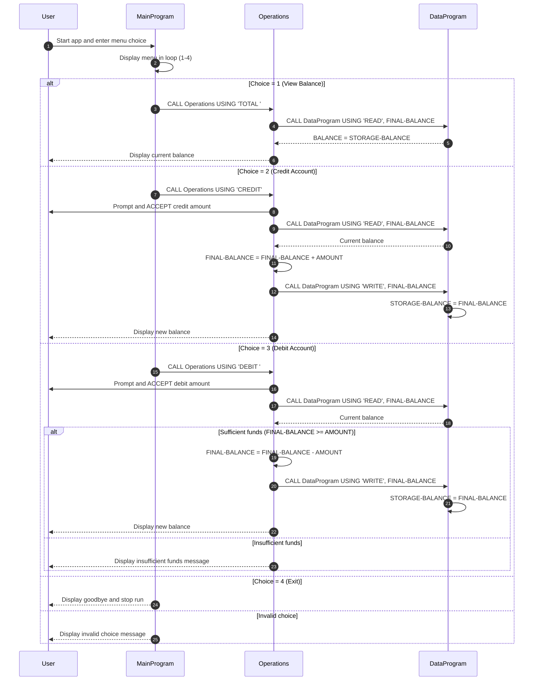

# COBOL Student Account Documentation

## Overview
This COBOL sample implements a simple student account management workflow with three programs:

- `MainProgram` provides the menu and user interaction.
- `Operations` performs account actions (view, credit, debit).
- `DataProgram` acts as a small data-access layer for account balance storage.

The programs communicate through `CALL ... USING` and fixed-length operation codes.

## File Purposes

### `src/cobol/main.cob` (`PROGRAM-ID. MainProgram`)
Purpose:
- Entry point for the application.
- Displays the account menu in a loop until the user exits.
- Routes user choices to the operations layer.

Key logic:
- `PERFORM UNTIL CONTINUE-FLAG = 'NO'` keeps the app running.
- `EVALUATE USER-CHOICE` maps:
  - `1` -> `CALL 'Operations' USING 'TOTAL '`
  - `2` -> `CALL 'Operations' USING 'CREDIT'`
  - `3` -> `CALL 'Operations' USING 'DEBIT '`
  - `4` -> exits loop
  - other values -> invalid-choice message

### `src/cobol/operations.cob` (`PROGRAM-ID. Operations`)
Purpose:
- Implements business operations for a student account.
- Reads and writes balance via `DataProgram`.

Key logic:
- Accepts operation code in `PASSED-OPERATION` (`PIC X(6)`).
- `TOTAL `:
  - Calls `DataProgram` with `READ`.
  - Displays current balance.
- `CREDIT`:
  - Prompts for amount.
  - Reads current balance.
  - Adds amount and writes updated balance.
  - Displays new balance.
- `DEBIT `:
  - Prompts for amount.
  - Reads current balance.
  - Subtracts only when funds are sufficient.
  - Otherwise displays insufficient-funds message.

### `src/cobol/data.cob` (`PROGRAM-ID. DataProgram`)
Purpose:
- Encapsulates account balance storage and access.
- Provides a small interface for read/write behavior.

Key logic:
- Stores balance in `STORAGE-BALANCE` (`PIC 9(6)V99`) with initial value `1000.00`.
- Accepts operation code (`READ` or `WRITE`) and a `BALANCE` parameter.
- `READ` copies internal storage to caller.
- `WRITE` updates internal storage from caller.

## Student Account Business Rules

1. Single-account model
- The system manages one balance value at a time.

2. Initial balance
- Account starts at `1000.00`.

3. Valid operations
- Supported user operations are view balance, credit, debit, and exit.

4. Debit protection
- Debit is allowed only when `current balance >= debit amount`.
- If not, no update is made and an insufficient-funds message is shown.

5. Credit behavior
- Credit always increases the current balance by the entered amount.

6. Amount format constraints
- Amount and balance fields use `PIC 9(6)V99` (up to 6 digits plus 2 decimals).
- Input outside this shape may be truncated or rejected depending on runtime behavior.

7. Operation code contract
- Inter-program commands are fixed-length (`PIC X(6)`) and must match exactly:
  - `TOTAL ` (with trailing space)
  - `CREDIT`
  - `DEBIT ` (with trailing space)
  - `READ`
  - `WRITE`

## Notes for Modernization
- `DataProgram` currently uses in-memory working storage; persistence is not externalized.
- Validation for negative or zero transaction values is not implemented.
- Multi-student or multi-account support is not implemented.

## Sequence Diagram (Data Flow)

